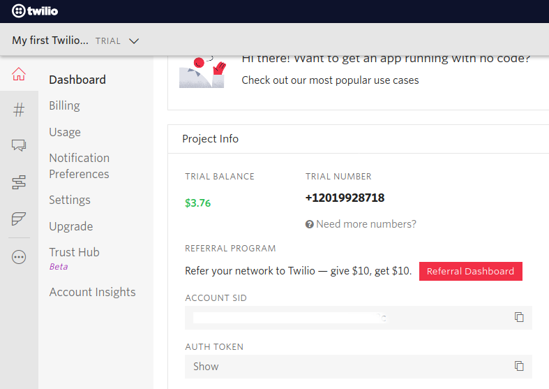

# Template: Google Calendar new event to Twilio SMS
## Integration Use Case
This template is useful when we want to get an SMS message when a new event is created in a Google Calendar. 
Each time a new event is created in a given Google Calendar, this template will send an new SMS to
given phone number. 

## Supported Versions

<table>
  <tr>
   <td>Ballerina Language Version
   </td>
   <td>Swan Lake Alpha2
   </td>
  </tr>
  <tr>
   <td>Google Calendar API Version
   </td>
   <td>V3
   </td>
  </tr>
  <tr>
   <td>Twilio API Version
   </td>
   <td>2010-04-01
   </td>
  </tr>
</table>

## Pre-requisites
* Download and install [Ballerina](https://ballerinalang.org/downloads/).
* Google account
* Twilio account

## Configuration
### Setup Google Calendar Configurations

1. Visit [Google API Console](https://console.developers.google.com), click **Create Project**, and follow the wizard to create a new project.
2. Go to **Credentials -> OAuth consent screen**, enter a product name to be shown to users, and click **Save**.
3. On the **Credentials** tab, click **Create credentials** and select **OAuth client ID**. 
4. Select an application type, enter a name for the application, and specify a redirect URI (enter https://developers.google.com/oauthplayground if you want to use 
[OAuth 2.0 playground](https://developers.google.com/oauthplayground) to receive the authorization code and obtain the 
access token and refresh token). 
5. Click **Create**. Your client ID and client secret appear. 
6. Click `Library` from the left side bar.
7. In the search bar enter Google Calendar.
8. Then select Google Calendar API and click Enable button.
9. In a separate browser window or tab, visit [OAuth 2.0 playground](https://developers.google.com/oauthplayground), select the required Google Calendar scopes, and then click **Authorize APIs**.
10. When you receive your authorization code, click **Exchange authorization code for tokens** to obtain the refresh token.
11. You can provide a random UUID for channel id and token and time in seconds for ttl.

### Setup Twilio Configuration

1.  To use Twilio service, you need to provide the following:

       - Account SId
       - Auth Token
       - Sender's and receiver's phone number

### Config.toml 

### Listener configurations
port = "PORT"

### ballerinax/googleapis_calendar related configurations 

clientId = "<CLIENT_ID>"  
clientSecret = "<CLIENT_SECRET>"  
refreshToken = "<REFRESH_TOKEN>"  
refreshUrl = "<REFRESH_URL>"  
address = "ADDRESS"  
calendarId = "<CALENDAR_ID>"  
channelId = "<CHANNEL_ID>"  
token = "TOKEN"   
ttl = "TTL"   

### ballerinax/twilio related configurations  

accountSId = "<ACCOUNT_SID>"  
authToken = "<AUTH_TOKEN>"  
fromMobile = "<FROM_MOBILE>"  
toMobile = "<TO_MOBILE>"  

## Running the Template

1. First you need to build the integration template and create the executable binary. Run the following command from the 
root directory of the integration template.   
`$ bal build`

2. Then you can run the integration binary with the following command.  
`$  bal run target/bin/calendar_twilio-0.1.0.jar`

3. Now you can add new event to the specific Google Calendar and verify by receiving an SMS to the given number.
